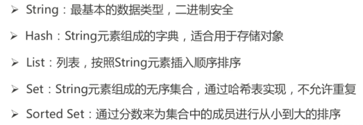
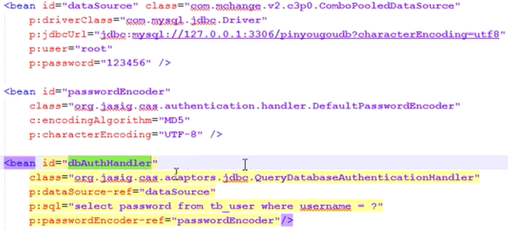
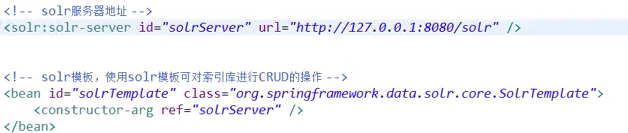

[1. spring中的aop？](#1)

[2. aop中相关术语？](#2)

[3. aop实现日志配置](#3)

[4. aop实现事务配置](#4)

[5. ioc三种注入方式？](#5)

[6.@Resource和@Autowired的区别](#6)

[7. bean的作用域](#7)

[8. @Autowired的流程](#8)

[9.springMvc处理流程？](#9)

[10. url和uri的区别？](#10)

[11. ${} 和 #{}的区别？](#11)

[12. mybatis实体属性名和表中字段不一样怎么办？](#12)

[13. mybatis的mapper接口的工作原理？](#13)

[14. mybatis怎么获得自动生成的主键值](#14)

[15. mybatis动态sql 及其原理？](#15)

[16. mybatis 怎么解决第一个<if>为null导致的前and的问题](#16)

[17. mybatis如何实现模糊查询？](#17)

[18. mybatis中除了增删改查标签，还有哪些？](#18)

[19. mybatis的缓存？](#19)

[20. 讲一下dubbo是什么？](#20)

[21. dubbo怎样向zookeeper注册和服务调用](#21)

[22.dubbo和springcloud的区别？](#22)

[23. 转发和重定向的区别？](#23)

[24. servlet生命周期](#24)

[25. CAP定理和base理论？](#25)

[26. redis基本数据类型？](#26)

[27. redis持久化方式？优缺点？](#27)

[28. redis 哨兵模式？](#28)

[29. 介绍一下单点登陆和它的实现CAS的原理？](#29)

[30. 怎样搭建cas服务器？客户端怎样实现？](#30)

[31. 什么是全文检索？如何实现全文检索](#31)

[32.什么是solr？](#32)

[33. 怎么搭建solr服务器？](#33)

[34. 客户端怎么使用solr进行查询服务？](#34)

### <span id="1">1.spring中的aop？</span>

​	（1）aop，面向切面编程，是对面向对象的一种补充（横向 纵向）就是找出对多个对象产生公共影响的行为，封装成一个可重用的模块。这样可以减少代码重复，降低耦合度（可用于事务 日志等）

​	（2）aop的关键在于aop框架自动创建aop代理，分为静态代理（在编译阶段生成代理类），动态代理（spring aop）。spring框架采用动态代理

​	（3）动态代理又有两种方式：JDK动态代理，cglib动态代理（当目标对象实现接口时用JDK动态代理，没有实现接口时用cglib代理）


### <span id="2">2. aop中相关术语？</span>

​	（1）切面：通用的业务逻辑代码

​	（2）连接点：虚概念，是指在应用执行过程中能够插入切面的一个点（可以是方法调用，抛出异常等）（spring只支持方法类型连接点，所以在spring中指方法调用）

​	（3）切点：具体确定的方法

​	（4）通知：拦截到连接点后具体要执行的代码（分为前置 后置 异常 环绕 返回）

​	（5）织入：将切面应用到目标对象的过程


### <span id="3">3. aop日志的具体实现</span>

​	基于注解实现

​	（1）springmvc.xml

```xml
<aop:aspectj-autoproxy proxy-target-class="true">  /*启用cglib代理*/
```

​		（proxy-target-class是基于类的代理  false将启用基于接口的JDK动态代理）

​	（2）配置切面

```java
@Aspect  
@Component  
public class LogInterceptor {  
    private final Logger logger = LoggerFactory.getLogger(LogInterceptor.class);  
    @Before(value = "execution(* com.gray.user.controller.*.*(..))")  
    public void before(){  
        logger.info("login start!");  
    }  
    @After(value = "execution(* com.gray.user.controller.*.*(..))")  
    public void after(){  
        logger.info("login end!");  
    }  
}
```


### <span id="4">4.aop实现事务配置</span>

​	（1）配置事务管理器

```xml
    <bean name="transactionManager" 	class="org.springframework.jdbc.datasource.DataSourceTransactionManager">
        <property name="dataSource" ref="dataSource"></property>
    </bean>
```

​	（2）开启基于注解的aop事务

```xml
 <tx:annotation-driven transaction-manager="transactionManager" />
```

​	（3）在使用事务的地方使用@Transaction注解（同时可以使用isolatio属性指定隔离级别 timeout指定超时时间 等等）


### <span id="5">5. ioc的三种注入方式？</span>

​	（1）构造方法注入

```xml
<bean id="userService" class="com.lyu.spring.service.impl.UserService">
	<constructor-arg ref="userDaoJdbc"></constructor-arg>
</bean>
```

​	（2）setter注入

```xml
<bean id="userService" class="com.lyu.spring.service.impl.UserService">
	<property name="userDao" ref="userDaoMyBatis"></property>
</bean>
```

​	（3）注解方式注入

@component @Repository @Controller @Service


### <span id="6">6. @Resource和@Autowired的区别？</span>

​	（1）Autowired是spring注解，默认ByType方式装配对象

​	（2）Resource是java注解，默认ByName方式装配对象


## <span id="7">7. bean的作用域</span>（scope=）

​	（1）Singleton：单实例

​	（2）Protype：多实例

​	（3）Request：web环境下，一次请求创建一个bean实例

​	（4）Session：web环境下，一次会话创建一个bean实例


### <span id="8">8. @Autowired的流程</span>

​	（1）先按类型到容器中找对应的组件，找到一个就装配

​	（2）没找到，抛异常

​	（3）找到多个，按变量名作为id继续装配

​	（4）如果变量名和id不一致，可修改变量名，也可加@Qualifier(“book”)指定id


### <span id="9">9. spring mvc处理流程？</span>

​	（1）用户向服务器发起请求，被前端控制器DispatcherServlet拦截

​	（2）DispatcherServlet对URL进行解析，得到URI，根据URI调用handlermapping得到Handler配置的所有相关对象（包括handler对象和handler对象对应的拦截器）返回个DispatcherServlet

​	（3）DispatcherServlet根据得到的handler选择合适的处理器适配器HandlerAdapter，执行Handler

​	（4）执行完成返回ModelAndView对象，选择一个合适的视图解析器ViewResolver返回给DispatcherServlet

​	（5）ViewResolver结合Model和View渲染视图，将渲染结果返回客户端

​	

### <span id="10">10.URL和URI的区别？</span>

​	URI:统一资源标志符，可以唯一标识一个资源

​	URL:统一资源定位符，不仅可以唯一标识一个资源，还可以唯一定位一个资源

​	（所以说URL是RUI的子集）

​	

### <span id="11">11. ${}和#{}的区别？</span>

​	（1）${}是字符串替换，mybatis会将${}替换为变量的值

​	（2）#{}是预编译处理，mybatis会将#{}替换为？，调用PreparedStatement的set方法来赋值，可以防止sql注入


### <span id="12">12.mybatis实体属性名和表中字段不一样怎么办？</span>

​	（1）sql语句中定义字段名的别名

```xml
	<select id=”selectorder” parametertype=”int” 		                               resultetype=”me.gacl.domain.order”>
       select order_id id, order_no orderno ,order_price price form orders where order_id=#{id};
    </select>

```

​	（2）通过<resultMap>来映射字段名和类属性名的对应关系

```xml
 <select id="getOrder" parameterType="int" resultMap="orderresultmap">
        select * from orders where order_id=#{id}
    </select>
 
   <resultMap type=”me.gacl.domain.order” id=”orderresultmap”>
        <!–用id属性来映射主键字段–>
        <id property=”id” column=”order_id”>
 
        <!–用result属性来映射非主键字段，property为实体类属性名，column为数据表中的属性–>
        <result property = “orderno” column =”order_no”/>
        <result property=”price” column=”order_price” />
    </reslutMap>

```


### <span id="13">13. mybatis的mapper接口的工作原理？</span>

​	mapper接口的全限定名就是映射文件中namespace的值，接口的方法名就是映射文件中MapperStatement的id值，接口方法内的参数，就是传递给sql的参数。工作原理就是JDK动态代理，mybatis运行时会使用JDK动态代理为mapper接口生成代理对象，代理对象拦截接口的方法，转而执行mapperstatment所代表的sql，然后将sql执行结果返回


### <span id="14">14. mybatis怎么获得自动生成的主键值？</span>


​	（1）方式一：自动生成的键在insert方法执行完后被设置到传入的参数对象中	

```xml
<insert id=”insertname” usegeneratedkeys=”true” keyproperty=”id”>
     insert into names (name) values (#{name})
</insert>

```

​	（2）方式二：使用<selectKey>标签

```xml
<insert id=”insertname”>
	<selectKey resultType="java.lang.Long" order="AFTER" keyProperty="id">
		SELECT_LAST_INSERT_ID()
	</selectKry>
     insert into names (name) values (#{name})
</insert>
```


### <span id="15">15. mybatis动态sql 及其原理？</span>

​	以标签的形式根据OGNL表达式的值动态的拼接sql

​	mybatis提供9种动态sql标签：if where trim choose  when  set otherwise bind（模糊查询）  foreach


### <span id="16">16. mybatis 怎么解决第一个if标签为null导致的前and的问题?</span>

​	（1）使用where标签

```xml
<select id="ListStudentByCondition" resultType="com.cn.cmc.bean.Student" >
    select * 
    from student
    <where>
        <if test="id!=null">
            and id = #{id}
        </if>
        <if test="name!=null and name.trim()!=''">
            and name = #{name}
        </if>
        <if test="age!=null && age!=""">
            and age = #{age}
        </if>
        <if test="sex=='M' or sex=='F'" >
            and trim(sex) = #{sex}
        </if>
    </where>
</select>

```

​	（2）使用trim标签

```xml
<select id="ListStudentByConditionTrim" resultType="com.cn.cmc.bean.Student" >
    <!-- trim标签拼接字符串
         prefix：给拼串后的字符串加上一个前缀
         prefixOverrides：去掉拼串后的字符串的一个前缀
         suffix：给拼串后的字符串加上一个后缀
         suffixOverrides：去掉拼串后字符串的一个前缀
         set标签：在更新中使用，可以去除多余的逗号
     -->
     select * 
     from student
    <trim prefix="where" prefixOverrides="and" suffix="" suffixOverrides="">
        <if test="id!=null">
            and id = #{id}
        </if>
        <if test="name!=null and name.trim()!=''">
            and name = #{name}
        </if>
        <if test="age!=null && age!=""">
            and age = #{age}
        </if>
        <if test="sex=='M' or sex=='F'" >
            and trim(sex) = #{sex}
        </if>
    </trim>
</select>

```


### <span id="17">17. mybatis如何实现模糊查询？</span>

​	使用bind标签，从OGNL表达式创建一个变量并绑定到元素中方便使用

```xml
<!-- 按名字模糊查询学生，假设在接口中有方法public Student getStudentByName(@Param("name")String name) ;
       bind标签：将OGNL表达式绑定到指定变量中
       name:绑定的变量名
       value：OGNL表达式
   -->
  <select id="getStudentByName" resultType="com.cn.cmc.bean.Student">
        <bind name="_name" value="'%'+name+'%'"/>
        select * 
        from student
        where name like #{_name}
  </select>

```


### <span id="18">18. mybatis中除了增删改查标签，还有哪些？</span>

​	<resultMap>:封装结果集

​	<sql>:sql片段标签

​	<include>:通过include引入sql片段

​	

### <span id="19">19. mybatis的缓存？</span>

​	（1）一级缓存：默认开启，是sqlsession层面进行的缓存（同一个sqlsession多次调用同一个方法，只会进行一次数据库查询）

​	（2）二级缓存：默认关闭，是mapper级别的缓存 （需要在mapper.xml文件下添加<cache/>来手动开启）


### <span id="20">20. 讲一下dubbo是什么？</span>

​	Dubbo是一个分布式服务框架，用来提供RPC远程服务调用方案，以及SOA（soa：面向服务的架构。Dubbo是soa的实现 ）服务治理方案。一般是一个系统充当服务端，向注册中心注册服务，一个是客户端，订阅注册中心的服务（zookeeper）


### <span id="21">21. dubbo怎样向zookeeper注册和订阅服务？</span>

​	（1）首先引入dubbo zookeeper相关jar包

​	（2）spring配置文件中

​		<dubbo:application name=*"dubbo**x**demo-service"*/>  

​		<dubbo:registry address=*"zookeeper://**192.16.25.132**:2181"*/> 

​		<dubbo:annotation package="cn.itcast.dubboxdemo.service" /> 

​	（3）在服务提供类进行@service注解，调用服务的地方用@refence注解


### <span id="22">22.dubbo和springcloud的区别？</span>

​	（1）dubbo基于RPC服务调用，springcloudr基于REST API调用（RPC是以方法为中心，REST API是以资源为中心（通过POST GET PUT DELETE操作资源））

​	（2）Dubbo服务注册中心一般用zookeeper，spring cloud一般用Eureka


### <span id="23">23. 转发和重定向的区别？</span>

​	（1）转发在服务器端完成，重定向在客户端完成

​	（2）转发是一次请求，重定向是两次请求

​	（3）转发地址栏没有变化，重定向地址栏有变化


### <span id="24">24. servlet生命周期</span>

​	（1）在容器启动或第一次访问servlet时进行**加载和实例化**（load-on-startup）（只实例化一次，说明servlet是单例的  load-on-start-up为负数，第一次请求被创建  为0或正数，容器启动时被创建）

​	（2）Servlet实例化后调用init（）**初始化**该servlet对象（建立数据库连接等）

​	（3）****处理请求**。调用service方法进行处理

​	（4）****销毁** 容器关闭时调用destory（）方法 释放资源


### <span id="25">25. CAP定理和BASE理论?</span>

​	CAP:对于一个分布式系统，不能同时满足一致性（同一时间数据相同），可用性（每个请求不管成功失败都有响应），分隔容忍（部分服务挂掉不影响系统正常服务）

​	Base理论：解决数据强一致性引起可用性降低的方案（放松对一致性的要求）

 

### <span id="26">26. redis基本数据类型？</span>




### <span id="27">27. redis持久化方式？优缺点？</span>

​	**rdb：**

​	（1）概念：对redis数据周期性的持久化

​	（2）触发方式：手动触发：SAVE 阻塞当前redis服务直到rdb完成

​							BGSAVE  fork出一个子进程，在后台完成持久化

​                		     自动触发：save 900 1 save 300 10 save 60 1000

​        （3）优点：（1）每个数据文件代表某时刻redis中数据，很适合备份

​			     （2）对读写服务影响小，fork出子进程操作

​                             （3）恢复大数据时比aof快

​        （4）缺点：可能丢失最后一次快照后的所有修改

​	**Aof：**

​	（1）概念：以每条写命令作为日志，以追加的形式写入日志文件

​	（2）优点：可以实现秒级同步

​	（3）缺点：相同数据量的aof文件大于rdb文件，占用磁盘执行效率低于rdb


### <span id="28">28. redis哨兵模式？</span>

​	哨兵是一个独立的进程，通过发送命令，等待redis服务器响应，从而监控运行的多个redis实例。当监控到master宕机，自动将slaver切换到master，然后通知给其它从服务器

​	配置：sentinel.conf中 ： setinel monitor mymaster（服务器名）+ip+端口+数字（代表几个哨兵同意就切换）


### <span id="29">29. 介绍一下单点登陆</span>(sso)？和它的实现CAS的原理？

​	Single sign on，简称sso。单点登陆。在分布式应用系统中，只要登陆一次，就可以访问其他相互信任的应用系统

​        CAS是单点登陆常用的一个实现方案，原理如下：

​	（1）用户访问cas客户端，首先经过一个过滤器AuthenticationFilter，通过判断是否有session判断是否登陆，没登陆则重定向到cas服务端

​	（2）cas服务端验证请求是否携带TGC（cookie中的value），如果携带并且合法则直接返回ST（service ticket 小令牌），否则返回登陆页面，用户输入账号密码验证成功后返回ST，并生成一个TGC写入cookie，同时生成一个TGT写入自己的缓存（TGT的id就是TGC）

​	（3）浏览器拿到ST 重定向到 cas客户端并携带ST，cas客户端携带该ST请求cas服务端认证该ST,认证成功后会在cas客户端创建session保留用户信息，以后该用户访问该客户端就会直接返回用户信息而不用再请求cas服务端。对于其它客户端，还是会请求到cas服务器，但是因为cookie中携带TGC 同时该TGC生成的TGT的id存在则验证通过，签发一个ST给这个客户端，然后再重复前面的步骤

​	

### <span id="30">30. 怎样搭建cas服务器？客户端怎样实现</span>

​	**cas服务器**

​		（1）cas项目的war包直接部署到tomcat

​		（2）去除https认证（HTTPS需要安全证书，需要向特定机构申请和购买）

​		（3）自定义认证处理器（默认认证管理器使用的是用户名密码写死在配置文件中的处理器）

​				

​		（4）自定义登陆表单（替换view下的login.jsp  并替换form）			

​	

​	**cas客户端**

​		（1）引入cas依赖

​		（2）web.xml  配置一系列的过滤器（CASFilter验证用户名密码  cas validation Filter令牌验证过滤器等）


### <span id="31">31. 什么是全文检索？如何实现全文检索？</span>

​	先读取要分析的内容，对内容进行分词，将分好的词加入索引文件。这样再查找某个词时很快能定位该词出现的位置

​	使用Lucene 。Lucene是全文检索工具包。提供文本分析引擎（没中文），索引引擎，查询引擎


### <span id="32">32. 什么是solr？</span>

​	solr是基于lucene的全文检索服务器。对外提供api接口，用户可以通过http请求提交一定格式的xml文件，生成索引。也可以通过get请求得到xml格式的返回结果


### <span id="33">33. 怎么搭建一个solr服务器？</span>

​	（1）将solr项目war包放到tomcat解压

​	（2）配置中文分词器（IK）

​			1）把IK相关文件拷到lib文件夹下

​			2）schema.xml下配置

​			

```xml
	<!--配置中文分词器-->
	<fieldType name="text_ik" class="solr.TextField">
		<analyzer class="org.wltea.analyzer.lucene.IKAnalyzer"/>
	</fieldType>

	<!--配置几个域，这几个就支持中文分词了，当然自己根据需求进行创建即可-->
	<field name="title_ik" type="text_ik" indexed="true" stored="true"/>
	<field name="content_ik" type="text_ik" indexed="true" stored="false" multiValued="true"/

```

​	（3）批量导入数据库中的数据

​			1）再solrconfig.xml中添加数据导入处理器

```xml
<requestHandler name="/dataimport" 
   class="org.apache.solr.handler.dataimport.DataImportHandler">
	<lst name="defaults">
		<str name="config">data-config.xml</str>
	</lst>
  </requestHandler>

```

​			2）config目录下添加一个data-config.xml（与上面一步配置的名字要一致）主要是配数据源

```xml
<?xml version="1.0" encoding="UTF-8" ?>
<dataConfig>
<dataSource type="JdbcDataSource"
			driver="com.mysql.jdbc.Driver"
			url="jdbc:mysql://localhost:3306/需要导入数据的数据库名"
			user="数据库账号"
			password="数据库密码"/>
</dataConfig>

```

​		3）schema.xml中配置域，代表数据库导入到solr中数据的字段内容


### <span id="34">34. 客户端怎么使用solr进行查询服务？</span>

​	（1）引入spring data solr依赖

​	（2）创建solr.xml文件



​	（3）实体类属性加注解（@field("item_title")）

​	（4）搜索：Query query = new Query("*:*");  solrTemplate.queryForPage(query,Item.class)