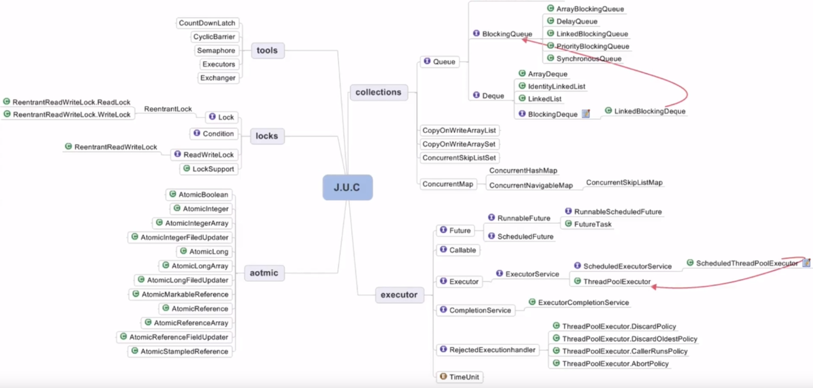
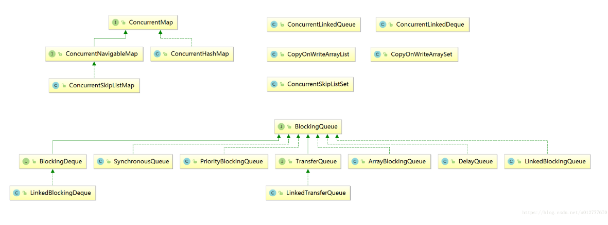

[1.谈谈缓存一致性？](#1)

[2.谈谈java内存模型？](#2)

[3.并发测试工具？](#3)

[4.线程安全性？](#4)

[5.Atomic包？](#4)

[6.CAS](#6)

[7.ABA问题？](#7)

[8.synchronized?](#8)

[9.volitale关键字？](#9)

[10.同步容器和并发容器？](#10)

[11.AQS](#11)

[12. synchronized和lock的区别？](#12)

#### 1.谈谈缓存一致性

为了解决i/o和cpu运算速度不匹配的问题，引入了缓存。但由于cpu的运算速度超过了一级缓存的i/o速率，所以引入了多级缓存。如何保证多个缓存数据的一致性，这里引入了一致性协议MESI。它规定了cache line的四种状态。M （modified）：表示数据被修改，要在其它缓存读取该数据前写回主存，变为独享状态 。E（exclusive）：数据和内存中数据一致，一旦有其它缓存读取主存该数据，就变为共享状态 。S（shared）：数据被多个缓存进行缓存，并且数据和内存中数据一致，一旦有其它缓存修改该缓存行的数据，将该缓存行变为无效。 I（invalid）：使该缓存行无效（有其它cpu修改了该缓存行）

### 2. 谈谈java内存模型(JMM)？

​	java memory model —— java内存模型，是java线程间通信的机制

​	线程之间共享变量存储在主内存，每个线程都有自己的本地内存，存储的是共享变量在本地的副本

#### 3. 并发测试工具？

（1）postman：接口测试 。也可测并发（但并不专业）

（2）Apache Bench（AB）：ab -n 1000 -c 50 http://localhost:8080/test  （1000次请求50次并发）

（3）Jmeter

#### 4. 线程安全性？

（1）原子性：同一时刻只能有一个线程操作

（2）可见性：一个线程对主内存的修改可及时被其它线程观察到

（3）有序性：一个线程中指令的执行顺序（由于指令重排序，顺序一般杂乱）

#### 5. Atomic包？

Atomic包是Java.util.concurrent下的另一个专门为线程安全设计的Java包,包括多个原子操作类

（1）AtomicInteger：首先atomic变量时volatile修饰的，保证了可见性和有序性。然后通过cas保证了原子性。所以对于它的操作是线程安全的

（2）LongAdder：AtomicInteger在大量修改失败时，这些循环尝试cas，这样性能受到影响。LongAdder高并发时依然能有很好性能

#### 6.CAS?

compare and swap。是一种乐观策略，需要三个操作数，内存地址，预期值，即将要更新的目标值。当内存地址的值与预期值相等时才将值修改为目标值，否则什么也不做。并再次进行cas操作

#### 7.ABA问题？

在cas操作的时候，其它线程将A改为B再改回A，本线程就认为该值没有变过。与实际不符合

（弊端eg：链表实现的栈，栈顶为A，next为B。要把栈顶更新为B,此时将A B出栈，PUSH进CDA，执行cas操作发现A没变，更新成功，B变为栈顶，但此时B.next为null，并不是CD）

解决方案：AtomicStampedReference 用版本戳来标记变量，更新时版本号+1

#### 8. synchronized?

是一种重量级锁，①修饰代码块，作用范围为大括号括起来的代码，作用与调用的对象②修饰方法，作用范围为整个方法，作用于调用的对象③修饰静态方法：作用范围为整个静态方法，作用于这个类的所有对象④修饰类：作用范围，括号括起来的部分，作用于这个类的所有对象

### 9.谈谈volatile关键字？

​	一旦一个共享变量（类成员变量，静态成员变量）被volatile修饰后，具备了两层语义：

​	（1）保证不同线程对这个变量操作时的可见性（怎么保证？volatile会强制将修改值立即写入主存，并且使其它线程的工作内存中该值无效，需要重新从主存读取）

​	（2）禁止进行指令重排序

​	（注意：volatile不能保证原子性，因为修改值和写入主内存不是一个原子操作）

#### 10. 同步容器和并发容器？

##### 同步容器

（1）含义：通过synchronized来实现同步的容器，比如vector，hashtable

（2）缺点：①并不一定线程安全的，比如get和delete操作，两者不具有原子性（delete last 同时get last导致数组越界异常）

​		     ②串行执行，影响效率

##### 并发容器

（1）含义：concurrent（J.U.C）包下的容器-java.util.concurrent

（2）arrayList——>CopyOnWriteArrayList：当我们往一个容器添加元素的时候，不直接往当前容器添加，而是先将当前容器进行Copy，复制出一个新的容器，然后新的容器里添加元素，添加完元素之后，再将原容器的引用指向新的容器。这样做的好处是我们可以对CopyOnWrite容器进行并发的读，而不需要加锁，因为当前容器不会添加任何元素。思想：读写分离，最终一致性

（3）hashset，treeset——>CopyOnWriteArraySet ConcurrentSkipListSet

（4）hashmap，treemap——>concurrenthashmap，ConcurrentSkipListMap

#### 11.AQS

（1）概念：AbstractQueuedSynchronize（抽象队列同步器），构建了一套多线程访问共享资源的同步器框架，许多同步类都依赖于它（如：ReentrantLock，semaphore，CountDownLatch）。维护了一个volatile int state（代表共享资源）和一个FIFO线程等待队列。并定义了两种资源共享方式：Exclusive（独占）和share（共享）。自定义同步器在实现时只需要实现共享资源state的获取（tryAcquire）与释放（tryRelease）方式即可

（2）CountDownLatch：类似于一个计数器的功能，初始化的时候传入一个正整数作为初始值，每次调用countdown方法该值减1，另一个线程调用它的await（）方法会导致该线程阻塞直到该值减为0

（3）Semaphore：是一种计数信号量，通常用于限制可以访问某些资源线程数目。new Semaphore(20)每次最多允许20个线程同时访问。acquire（）获取一个许可 release（）释放一个许可

（4）CyclicBarrier:循环（Cyclic）的屏障（Barrier）。允许一组线程循环等待，直到达到某个公共屏障点。new CyclicBarrier(5);  ----> cyclicBarrier.await();(5个线程后才继续执行)

（5）ReentReadWriteLock：在没有任何读写锁的时候才可以获取写入锁

#### 12. synchronized和lock的区别？

​	（1）synchronized遇到异常时自动释放锁，lock不会（所以需要在finally中lock.unlock释放锁）

​	（2）lock可以指定等待时间（lock.trylock(5,TimeUnit.SECOND)）

​	（3）synchronized是java关键字 lock是一个类