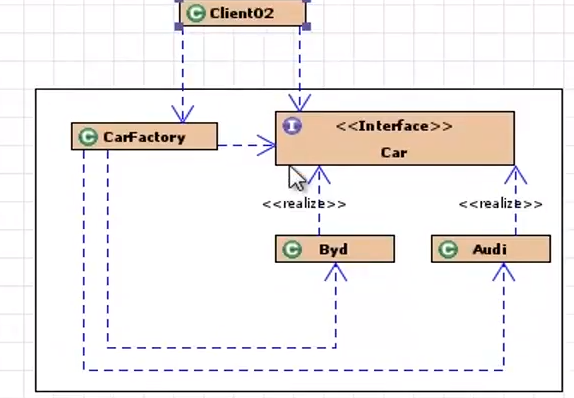
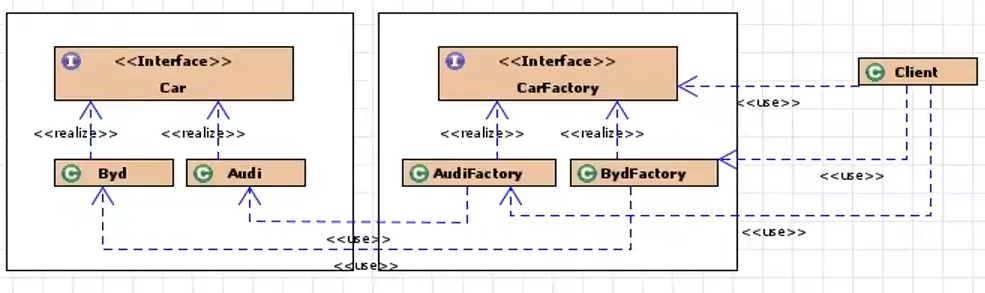
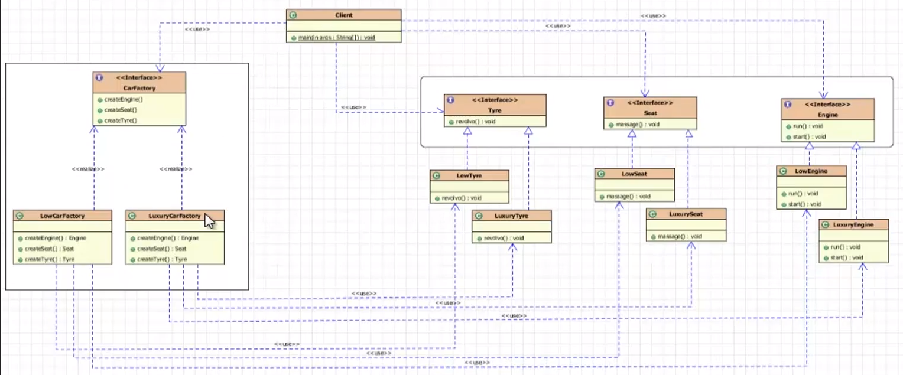

[一. 单例模式](#1)

[二. 策略模式](#2)

[三. 模板方法模式](#3)

[四. 观察者模式](#3)

[五. 简单工厂模式](#5)

[六. 工厂方法模式](#2)

[七.抽象工厂模式](#7)

[八. 代理模式](#8)

#### <span id="1">一. 单例模式？</span>

1.懒汉模式

```java
public class Singleton_lazy {
    private Singleton_lazy(){};
    private Singleton_lazy instance = null;

    public Singleton_lazy getInstance(){
        if (instance == null){
            return new Singleton_lazy();
        }
        return instance;
    }

}
```

```java
/**
 * 存在线程安全问题：因为判空操作和创建对象不是一个原子操作
 *
 * 解决方案：双重校验锁
 * public class Singleton_lazy {
 *     private Singleton_lazy(){};
 *     private Singleton_lazy instance = null;
 *
 *     public Singleton_lazy getInstance(){
 *         if(instance == null){
 *             synchronized (Singleton_lazy.class){
 *                 if (instance == null){
 *                     return new Singleton_lazy();
 *                 }
 *             }
 *         }
 *         return instance;
 *     }
 * }
*/

```

2.饿汉模式

```
public class Singleton_hungry {
    private Singleton_hungry(){};
    Singleton_hungry instance = new Singleton_hungry();

    public Singleton_hungry getInstance(){
        return instance;
    }
}
```

3.静态内部类

```java
//既实现了延迟加载，也保证了线程安全
public class Singleton_Inner {

    private  Singleton_Inner(){};

    private static class Singleton{
        public static Singleton_Inner instance = new Singleton_Inner();
    }

    public Singleton_Inner getInstance(){
        return Singleton.instance;
    }
}
```


#### <span id="1">二. 策略模式？</span>

1.概念：策略模式对应解决某个问题的算法族，允许用户从算法族任选一个算法解决某一问题。可以方便的更换或新增算法，并且由客户端决定调用哪个算法

2.实现

（1）策略接口

```java
public interface Strategy {
    public double getPrice(double standardPrice);
}
```

（2）不同算法

```java
public class NewCustomerStrategy implements Strategy {
    @Override
    public double getPrice(double standardPrice) {
        System.out.println("不打折，原价");
        return standardPrice;
    }
}

public class OldCustomerStrategy implements Strategy {
    @Override
    public double getPrice(double standardPrice) {
        System.out.println("打9折");
        return standardPrice*0.9;
    }
}
```

（3）上下文对象

```java
/**
 * @Description: 负责和具体的策略类交互  使算法可以独立于客户端独立的变化
*/
public class Context {
    private Strategy strategy; //当前采用的算法

    //通过构造器来注入
    public Context(Strategy strategy) {
        this.strategy = strategy;
    }

    //通过set方法注入
    public void setStrategy(Strategy strategy) {
        this.strategy = strategy;
    }

    //如果使用spring，还可以通过配置文件，动态的注入

    public void printPrice(double price){
        System.out.println("价格"+strategy.getPrice(price));
    }
}
```

（4）客户端

```java
public class Client {
    public static void main(String[] args) {
        OldCustomerStrategy customer = new OldCustomerStrategy();
        Context context = new Context(customer);
        context.printPrice(1000);

    }
}
```


#### <span id="1">三. 模板方法模式？</span>

1.概念：定义了一个操作中的算法骨架，将某些步骤延迟到子类中实现。这样，新的子类可以在不改变一个算法结构的前提下重新定义该算法的某些特定步骤

2.实现

（1）抽象模板方法类

```java
public abstract class BankTemplateMethod {
    //具体方法
    public void tackNumber(){
        System.out.println("取号排队");
    }

    public abstract void transact();

    public void evaluate(){
        System.out.println("反馈评分");
    }

    //模板方法
    public final void process(){
        this.tackNumber();
        this.transact();
        this.evaluate();
    }

}

```

（2）子类实现抽象方法 

```java
class DrawMoney extends BankTemplateMethod{

    @Override
    public void transact() {
        System.out.println("我要取款1000元");
    }
}
```

（3）客户端调用子类的模板方法

```java
public class Client{
    public static void main(String[] args) {
        DrawMoney drawMoney = new DrawMoney();
        //调用子类模板方法
        drawMoney.process();
    }
}
```


#### <span id="4">四. 观察者模式？</span>

1.概念

观察者模式主要用于1:N的通知。当一个对象（目标对象）的状态变化时，需要告知一系列对象（观察者对象），另他们做出相应

2. 实现

   java.util中提供观察者的包

   （1）主题：被观察者

   ```java
   public class ConcreteSubject extends Observable {
       private int state;
   
       public int getState() {
           return state;
       }
   
       public void setState(int state) {
           this.state = state;
           //表示目标对象已经做了更改
           setChanged();
           //通知所有的观察者
           notifyObservers(state);
       }
   }
   ```

   （2）观察者

   ```java
   public class ObserverA implements Observer {
       private int myState;
   
       public int getMyState() {
           return myState;
       }
   
       public void setMyState(int myState) {
           this.myState = myState;
       }
   
       @Override
       public void update(Observable o, Object arg) {
           myState = ((ConcreteSubject)o).getState();
       }
   }
   ```

   （3）客户端

   ```java
   public class Client {
       public static void main(String[] args) {
           ConcreteSubject subject = new ConcreteSubject();
           // 三个观察者
           ObserverA observer1 = new ObserverA();
           ObserverA observer2 = new ObserverA();
           ObserverA observer3 = new ObserverA();
   
           //添加到观察队列
           subject.addObserver(observer1);
           subject.addObserver(observer2);
           subject.addObserver(observer3);
   
           // 改变subject状态
           subject.setState(300);
   
           System.out.println(observer1.getMyState());
           System.out.println(observer2.getMyState());
           System.out.println(observer3.getMyState());
       }
   }
   ```

   

#### <span id="5">五. 简单工厂模式？</span>

1.实现

​	通过接收参数的不同来返回不同的实例对象



（1）接口 及实现类

```java
public interface Car {
    public void run();
}

public class Audi implements Car {
    @Override
    public void run() {
        System.out.println("Audi is running");
    }
}

public class Byd implements Car {
    @Override
    public void run() {
        System.out.println("Byd is running");
    }
}
```

（2）工厂类

```java
public class CarFactory {
    public static Car createCar(String type){
        if ("Audi".equals(type)){
            return new Audi();
        }else if ("Byd".equals(type)){
            return new Byd();
        }
        return null;
    }
}

```

（3）客户端

```java
public class Client {
    public static void main(String[] args) {
        Car Audi = CarFactory.createCar("Audi");
        Car Byd = CarFactory.createCar("Byd");

        Audi.run();
        Byd.run();
    }
}

```


2.缺点

对于增加新产品无能为力，不修改代码的话，无法扩展


#### <span id="6">六. 工厂方法模式？</span>

1.实现



（1）接口及实现类

```java
public interface Car {
    public void run();
}

public class Audi implements Car {
    @Override
    public void run() {
        System.out.println("Audi is running");
    }
}

public class Byd implements Car {
    @Override
    public void run() {
        System.out.println("Byd is running");
    }
}
```

（2）工厂接口及工厂实现类

```java
public interface CarFactory {
    Car createCar();
}

public class AudiFactory implements CarFactory {
    @Override
    public Car createCar() {
        return new Byd();
    }
}

public class BydFactory implements CarFactory {
    @Override
    public Car createCar() {
        return new Byd();
    }
}
```

（3）客户端

```java
public class Client {
    public static void main(String[] args) {
        Car Audi = new AudiFactory().createCar();
        Car Byd = new BydFactory().createCar();

        Audi.run();
        Byd.run();
    }
}

```


2.优点： 解决了简单工厂模式中的代码耦合问题，符合开闭原则（对扩展开放，对修改关闭）

   缺点：每一个产品对应一个工厂，类数目增多，不利于维护


#### <span id="7">七. 抽象工厂模式？</span>

用来生产不同产品族的全部产品。工厂方法模式中一个工厂只对应的一种产品，这样可能存在大量的工厂类。抽象工厂将相关的产品组成产品族，由同一个工厂来生产，减少了工厂类




1.实现

（1）座椅接口及实现  引擎接口及实现

```java
public interface Engine {
    void run();
    void start();
}

class goodEngine implements  Engine{

    @Override
    public void run() {
        System.out.println("转的快");
    }

    @Override
    public void start() {
        System.out.println("启动快");
    }
}

class badEngine implements  Engine{

    @Override
    public void run() {
        System.out.println("转的慢");
    }

    @Override
    public void start() {
        System.out.println("启动慢");
    }
}
...
//座椅同理
```

（2）工厂接口及实现

```java
public interface CarFactory {
    Engine createEngine();
    Seat createSeat();
}

class goodCarFactory implements CarFactory{

    @Override
    public Engine createEngine() {
        return new goodEngine();
    }

    @Override
    public Seat createSeat() {
        return new goodSeat();
    }
}

class badCarFactory implements CarFactory{

    @Override
    public Engine createEngine() {
        return new badEngine();
    }

    @Override
    public Seat createSeat() {
        return new badSeat();
    }
}
```

（3）客户端

```java
public class Client {
    public static void main(String[] args) {
        goodCarFactory goodCarFactory = new goodCarFactory();
        Engine engine = goodCarFactory.createEngine();
        engine.run();
        engine.start();
    }
}
```


#### <span id="8">八. 代理模式</span>

1.概念：通过代理类访问目标对象，可以在目标对象实现的基础上，增强额外的功能

2.分类

（1）静态代理（静态生成的代理类）

（2）动态代理（动态生成的代理类）

​		*JDK动态代理

​		*CGLib


